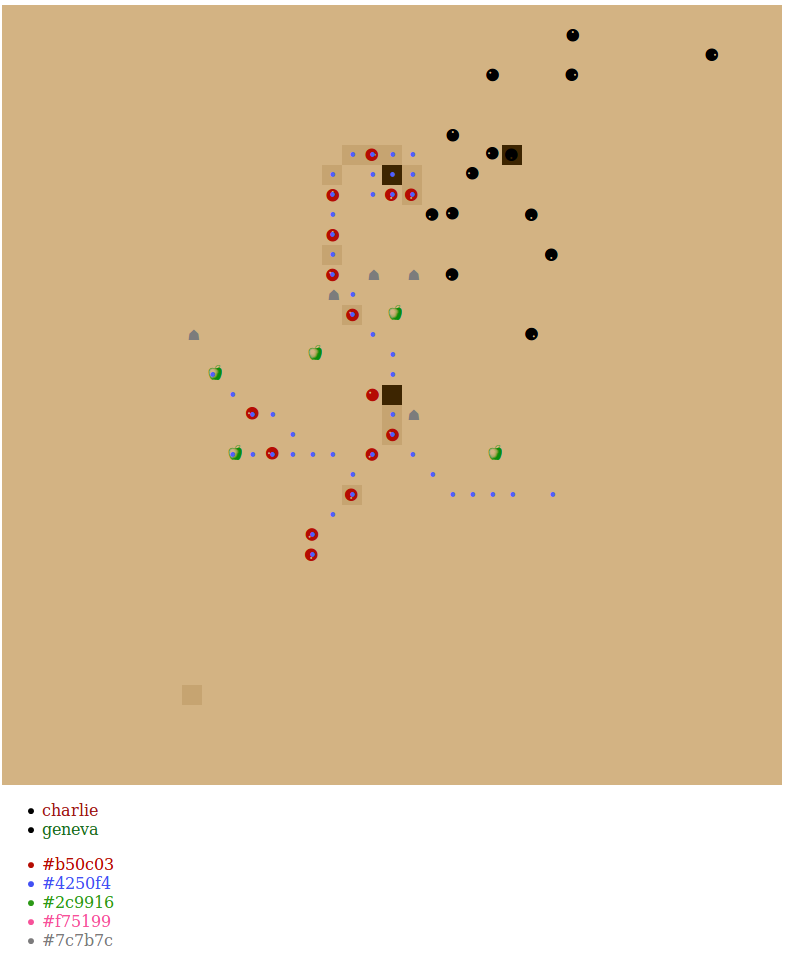

# Colony

**http://colony.josephburnett.com**

Colony is a multiplayer ant colony game for kids (and adults). 

## Gameplay

Players create a colony which is placed randomly on the map. Pressing 'Space' produces ants (⚈) which wander around for a while and then die. Ants can be guided with phermones (•) which they will follow whenever possible. When an ant encounters an opposing ant, it attacks and kills it (unless you're friends). Players of other colonies can see your ants but they cannot see your phermones so they don't know what you're planning.

When ants die they enrich the soil which turns darker brown. If enough ants die in an area it starts producing food (🍎) The objective of the game is to collect as much food as possible and return it to the colony. (Currently the ants just eat the food, but I'm working on that :)

## Screenshot



## Advanced Play

Colony is designed to have a very low barrier to entry. If your kid can press 'Space' then they can play Colony. You can help them out by connecting to the same colony with a different computer and laying some phermones for them.

There are many interesting things you can do with phermones. The most simple is to lay a trail out to a piece of food and back again to the colony. More sophisticated patterns can divide a trail of ant. Encircle enemies. Prestage attack patterns. Collect ants into a "farm" for making food. Etc...

And if you just want to mix things up you can drop a rock by typing "rock". Ants must work their way around rocks on the field of play. They will eventually decay but it makes for an interesting obstruction. Or drop a piece of fruit by typing "food". Any ant in the way will be instantly squished. Be careful! (Or not.)

Need a change of scene? Press 'Escape' and your colony will pickup and turn into a queen. A queen behaves just like a regular ant and will follow any phermone trail you leave. When it dies it turns back into a colony again.

Don't like the killing? Click on the name of another colony to become friends (green). Don't like the color red? Click on another color at the bottom to change the color of your ants.

## Building and Running

Colony is hosted at http://colony.josephburnett.com but it can run locally too, so that you don't have to connect your kid's computer to the Internet. The whole game is a single binary.

### Build 

```shell
git clone https://github.com/josephburnett/colony.git
cd colony
bin/build.sh
```

(Requires lein, protoc and some other stuff--I still need to package dendencies.)

### Run

```shell
build/colony
```

Open http://localhost:8080.

### Dev

To hack on the game:
```shell
cd client
lein figwheel
```
```shell
bin/genclient-dev.sh
cd server
go run *go
```

The server defaults to port 8080. See [config.go](https://github.com/josephburnett/colony/blob/master/server/lib/config.go) for all the commandline options.

## Limitations

The UI is just a table that gets updated twice per second. And it eats like 25% CPU so things run a little hot. I'm working on a lighter weight UI and a smaller protobuf representation of the world (instead of JSON).
